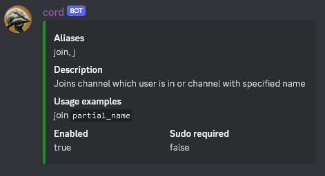
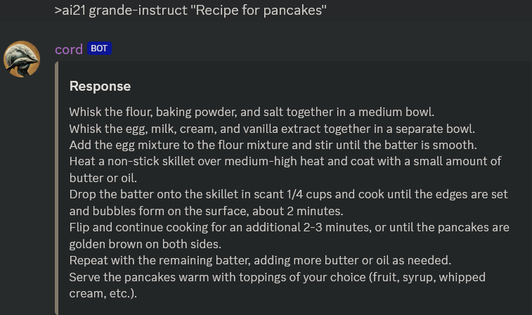
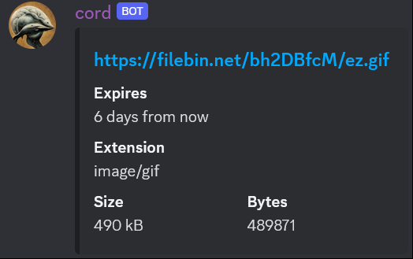

# Discord Bot written in Java

### Custom design:
> Commands' design is modular where each command extends the 'Command' class.  
  Aliases are passed to command's constructor instead of using reflection and annotations.  
  On commands initialization the command map is populated with keys (all aliases) to improve lookup times.  
  Messages from users are parsed regardless of the number of whitespaces between arguments,
  while also accounting for arguments inside quotes that is treating them as one.  
  Playing youtube's dash format with m4a extension is not yet possible since such
  audio files do not contain chunk tables. Adding a 100MB dependency like ffmpeg isn't a viable solution.

### Some functionalities:

- playback of local audio files (supported formats: wav, mp3, snd, aiff, aifc, au)
- AI21 API
- filebin API
- song queue
- purging messages
- downloading youtube videos/audio
- emergency listener (listens for suspicious events)
***
### Dependencies used:
 - tritonus libs (sample rate conversion),
although not used directly in code, they're a supplement for existing methods
 - JDA (java discord api)
 - jlayer from javazoom to convert mp3's 
 - javamp3 from fr.delthas to obtain mp3 metadata 
 - sealedtx/java-youtube-downloader to retrieve youtube content
 - fastjson (json parser)
 - junit (tests)
 - apache httpclient fluent API (requests)

### Sources:
 - http://www.tritonus.org/plugins.html
 - https://github.com/DV8FromTheWorld/JDA
 - https://mvnrepository.com/artifact/javazoom/jlayer/1.0.1
 - https://github.com/Delthas/JavaMP3
 - https://github.com/sealedtx/java-youtube-downloader
 - https://github.com/alibaba/fastjson

### TODO:
- change mp3 libraries to improve audio quality
- find a way to read dash format
- create a custom logger
- add seek command for audio playback

***

***
